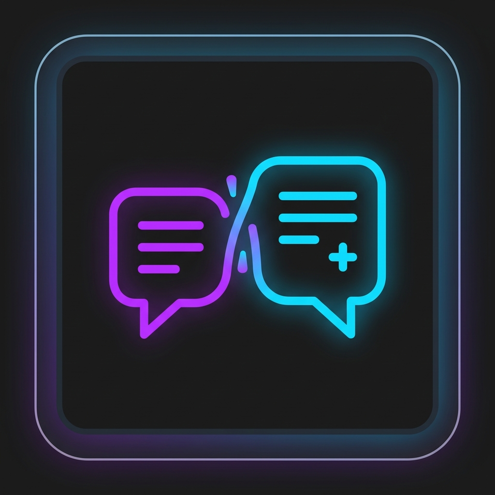
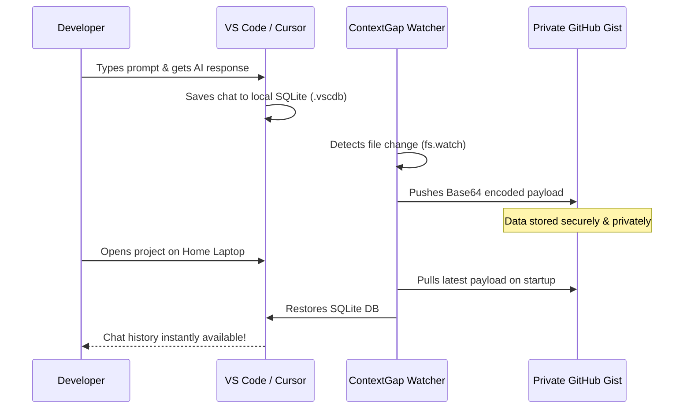

<div align="center">
  
  
  # ContextGap (Global AI Chat Sync)
  
  **Never lose your IDE's AI context again. Seamlessly sync your Copilot, Cursor, and Windsurf chat history across all your machines—in 2 seconds.**

  [](https://opensource.org/licenses/MIT)
  [](http://makeapullrequest.com)
  [](https://code.visualstudio.com/)

  *Stop re-explaining your codebase architecture every time you switch from your office laptop to your home PC.*
</div>

---

## 🚀 The Magic in Action
*(Demo GIF goes here - Showing a chat on Laptop A instantly appearing on Laptop B)*
<div align="center">
  
</div>

---

## 📑 Table of Contents
- [The Problem](#-the-problem-ide-amnesia)
- [The Solution](#-the-solution-contextgap)
- [Key Features](#-features)
- [How it Works (Architecture)](#-how-it-works-architecture)
- [Installation & Setup](#-installation--setup)
- [Self-Hosting](#-pluggable-storage--self-hosting)
- [Security & Privacy](#-security--privacy)

---

## 😫 The Problem: "IDE Amnesia"
Modern AI IDEs (Cursor, Windsurf, VS Code + Copilot) are incredibly smart, but they suffer from Amnesia. 
Your codebase syncs beautifully via Git, but your **AI Chat History and Context** are stored locally. 

When you switch devices, you lose the hours you spent explaining your architecture, debugging complex bugs, and setting up the AI's mental model. Re-prompting wastes your time and expensive API tokens.

## ✨ The Solution: ContextGap
ContextGap is a lightweight, zero-config extension that bridges the gap.
It automatically watches your IDE's hidden SQLite AI databases and pushes changes to a **Private GitHub Gist**. Open your project on any other machine, and your entire chat history is instantly restored.

### 🌟 Features
- ⚡ **Zero-Config Setup:** Uses VS Code's built-in GitHub authentication. No API keys or external accounts required.
- 🔒 **100% Private:** Your chat history is Base64 encoded and synced strictly to your own Private GitHub Gists.
- 🤖 **Works in the Background:** Debounced `fs.watch` automatically syncs your chats the moment the AI finishes typing.
- 🔌 **Pluggable Storage:** Prefer self-hosting? Ditch GitHub Gists and point ContextGap to your own Node.js backend.
- 📂 **Workspace-Aware:** Keeps chats strictly isolated per project folder. No bleeding of context between different codebases.

---

## 🏗️ How it Works (Architecture)



---

## 🛠️ Installation & Setup

1. Search for **ContextGap** in the VS Code / Cursor Extensions Marketplace.
2. Click **Install**.
3. A popup will ask you to Sign in with GitHub. Click **Allow**.
4. Look at your Status Bar (bottom right). You should see `$(sync) ContextGap: Auto`. 
5. Start chatting with your AI! It's already syncing in the background.

---

## 🔌 Pluggable Storage & Self-Hosting
By default, ContextGap uses GitHub Gists. However, if you want full control, a self-hosted Node.js server is included in the `server/` directory.

```bash
cd server/
npm install
npm run dev
```
Update your VS Code Settings to point to your custom server instead of GitHub.

---

## 🛡️ Security & Privacy
ContextGap is built with privacy-first principles:
- **No Telemetry:** We don't track your usage.
- **No Intermediary Servers:** In default mode, data travels directly from your IDE to your private GitHub Gist.
- **Workspace Isolation:** Hashes of your folder paths (`workspaceId`) ensure no cross-contamination of project chats.

---

## 🤝 Contributing
Want to add support for AWS S3, Google Drive, or a new AI IDE? PRs are highly welcome!

1. Fork the Project
2. Create your Feature Branch (`git checkout -b feature/AmazingFeature`)
3. Commit your Changes (`git commit -m 'Add some AmazingFeature'`)
4. Push to the Branch (`git push origin feature/AmazingFeature`)
5. Open a Pull Request
