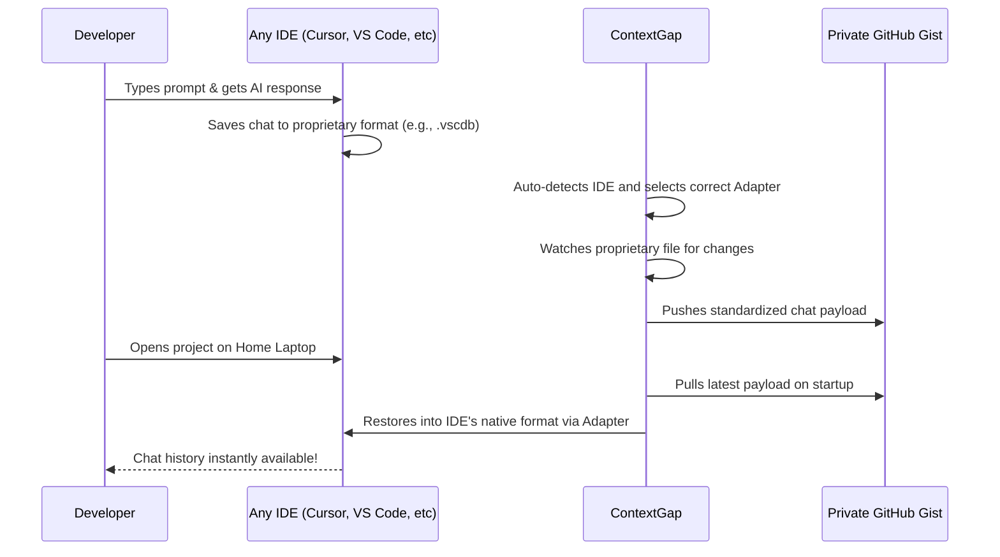

<div align="center">
  
  
  # ContextGap (Global AI Chat Sync)
  
  **The World's First Universal AI Chat Sync Engine.**
  **Seamlessly sync your Copilot, Cursor, Antigravity, JetBrains, and Zed chat history across all your machines—in 2 seconds.**

  [](https://opensource.org/licenses/MIT)
  [](http://makeapullrequest.com)

  *Stop re-explaining your codebase architecture every time you switch from your office laptop to your home PC.*
</div>

---

## 🚀 The Magic in Action
*(Demo GIF goes here - Showing a chat on Laptop A instantly appearing on Laptop B)*
<div align="center">
  
</div>

---

## 📑 Table of Contents
- [The Problem: IDE Amnesia](#-the-problem-ide-amnesia)
- [The Solution: ContextGap](#-the-solution-contextgap)
- [Supported IDEs](#-supported-ides-the-universal-adapter-system)
- [How it Works (Architecture)](#-how-it-works-architecture)
- [Installation & Setup](#-installation--setup)
- [Self-Hosting](#-pluggable-storage--self-hosting)

---

## 😫 The Problem: "IDE Amnesia"
Modern AI IDEs (Cursor, Antigravity, VS Code + Copilot) are incredibly smart, but they suffer from Amnesia. 
Your codebase syncs beautifully via Git, but your **AI Chat History and Context** are stored locally in hidden proprietary formats (SQLite databases, JSONL files, encrypted protobufs). 

When you switch devices, you lose the hours you spent explaining your architecture, debugging complex bugs, and setting up the AI's mental model. Re-prompting wastes your time and expensive API tokens.

## ✨ The Solution: ContextGap
ContextGap is a lightweight, zero-config extension that bridges the gap.
It automatically auto-detects your IDE, finds where your chat is hidden, translates it, and pushes it to a **Private GitHub Gist**. Open your project on any other machine (even on a different IDE!), and your entire chat history is instantly restored.

---

## 🌍 Supported IDEs (The Universal Adapter System)

ContextGap uses a powerful **IDE Auto-Detection Engine**. It currently supports:

| IDE | Chat Storage Format | Supported? |
|---|---|---|
| **VS Code (Copilot)** | SQLite (`.vscdb`) | ✅ Yes |
| **Cursor IDE** | SQLite (`.vscdb`) | ✅ Yes |
| **Antigravity IDE** | JSONL (`transcript.jsonl`) | ✅ Yes |
| **JetBrains Family** | XML files | ✅ Yes |
| **Zed Editor** | SQLite (Zstd) / JSON | ✅ Yes |
| **Windsurf / Others** | `Generic Fallback` | ✅ Yes (via `.contextgap-state.json`) |

*Note: ContextGap auto-detects the IDE at startup. You don't need to configure anything.*

---

### 🌟 Features
- ⚡ **Zero-Config Setup:** Uses VS Code's built-in GitHub authentication. No API keys required.
- 🔒 **100% Private:** Your chat history is synced strictly to your own Private GitHub Gists.
- 🤖 **Universal Translation:** Switches between different IDE proprietary chat formats effortlessly.
- 🔌 **Pluggable Storage:** Prefer self-hosting? Ditch GitHub Gists and point ContextGap to your own Node.js backend.
- 📂 **Workspace-Aware:** Keeps chats strictly isolated per project folder. No bleeding of context.

---

## 🏗️ How it Works (Architecture)



---

## 🛠️ Installation & Setup

1. Search for **ContextGap** in the Extensions Marketplace.
2. Click **Install**.
3. A popup will ask you to Sign in with GitHub. Click **Allow**.
4. Look at your Status Bar (bottom right). You should see `ContextGap: Auto | IDE: <Your IDE Name>`. 
5. Start chatting with your AI! It's already syncing in the background.

---

## 🔌 Pluggable Storage & Self-Hosting
By default, ContextGap uses GitHub Gists. However, if you want full control, a self-hosted Node.js server is included in the `server/` directory.

```bash
cd server/
npm install
npm run dev
```
Update your Settings (`contextgap.storageMethod`) to point to your custom server instead of GitHub.

---

## 🤝 Contributing
Want to add support for a new IDE? Check out `src/adapters/IdeAdapter.ts`. PRs are highly welcome!
